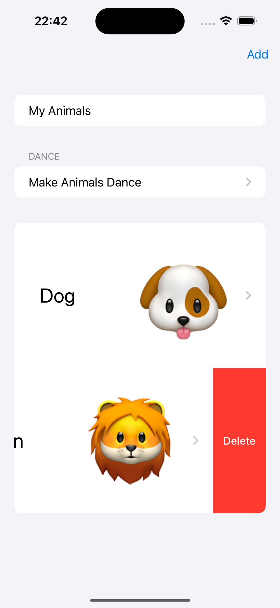
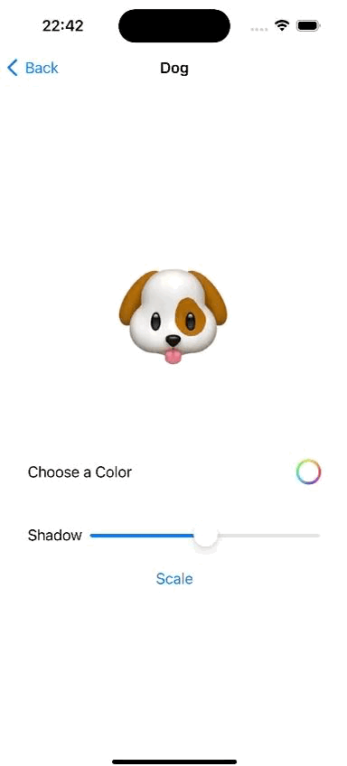
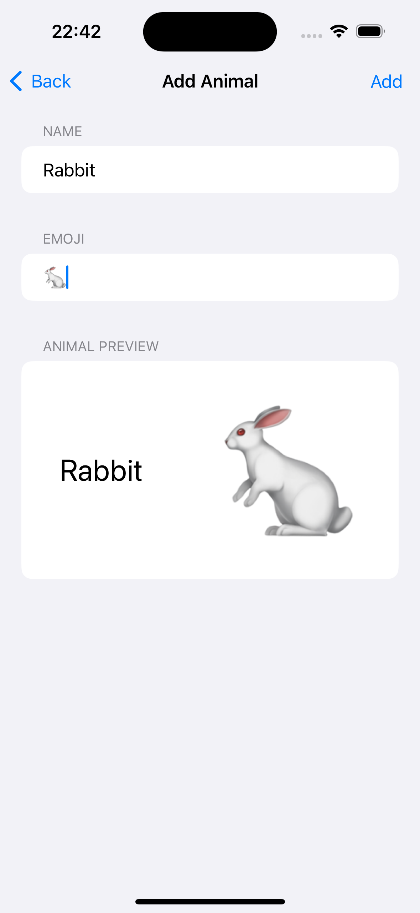

# Animals

<details close>
  <summary>Uygulamaya ait ekran görüntülerini görmek için tıklayın.</summary>
    
</details>

## Teknoloji

Swift

## Özellikler

- ObservableObject ile uygulama içerisinde veri transferi yapabilmek.
- NavigationStack ve NavigationLink kullanılarak ekranlar arası geçiş yapabilmek.
- Hayvanları listeleyebilmek, yeni hayvan ekleyebilmek ve silebilmek.

## Kurulum

Bu depoyu yerel makinenizde klonlayın.

```
git clone https://github.com/ibrahimaykutbas/Animals.git
```

### Hazırlık

Projeyi klonladıktan sonra ilgili dizine gidin.

```
cd Animals
open Animals.xcodeproj
```

Bu talimatlar, geliştirme ve test amacıyla yerel makinenizde projenin bir kopyasını hazır hale getirecektir.
